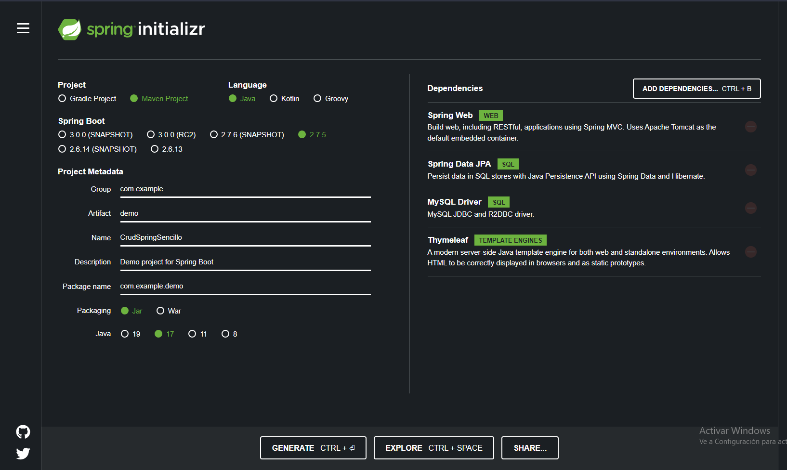
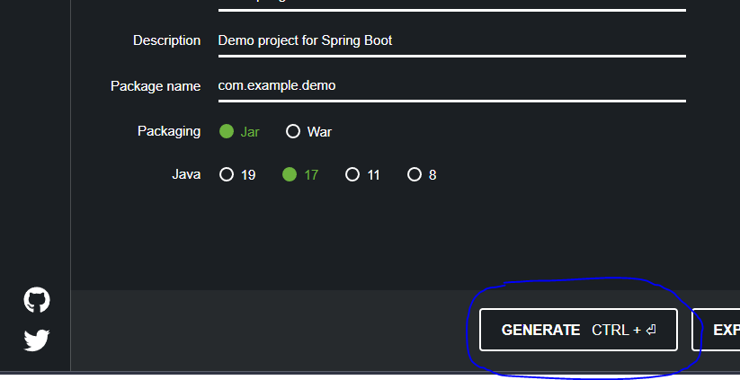
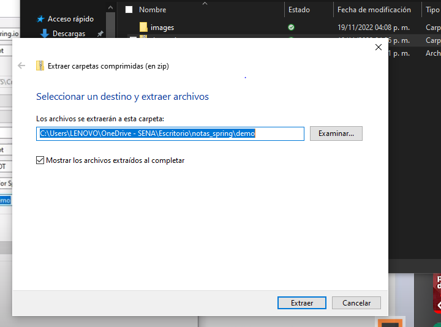
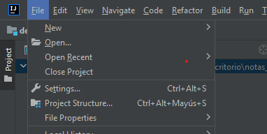
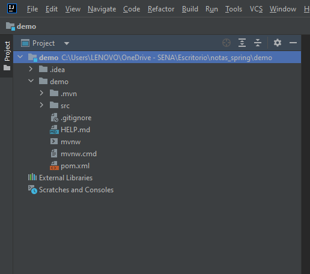
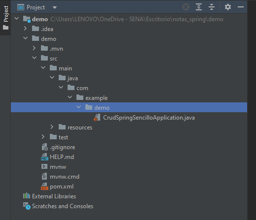
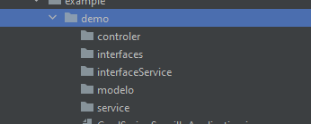

# Crud con spring usando MVC | Thymeleaf | MySQL | REST API

 - [Crear Proyecto](#spring-initializr)
     - [Agregar Dependencias](#dependencias)
 - [Estructura del proyecto](#creamo-la-estructura-del-protecto)
  

**CRUD**
- Create
- Read
- Update
- Delete

## Crear proyeccto

### Spring Initializr

:point_right:  [Initializr](https://start.spring.io/ "Spring Initializr")

Type: Maven

Name: CrudSpringSencillo

### Dependencias:

- Spring Data JPA
- Spring Web
- MySQL Driver
- Thymeleaf

Luego damos click en: Generate

Esto nos va a descargar un archivo .zip que contiene el proyecto generado.

Ahora vamos a abrir el proyecto desde un editor de codigo.

- Descomprimimos el archivo

- abrimos el archivo

- Seleccionamos el proyecto y ya lo tendriamos en nuestro IDE

- Lo primero seria ejecutar el proyecto para que se carguen todas las configuraciones

## Creamo la estructura del protecto

Para esto vamos a crear los paquetes de la estructura del proyecto dentro de nuestro paquete principal.

En este caso seria  demo/src/main/java/com/example/demo/

- controler
- interfaces
- modelo
- service
- interfaceservice

